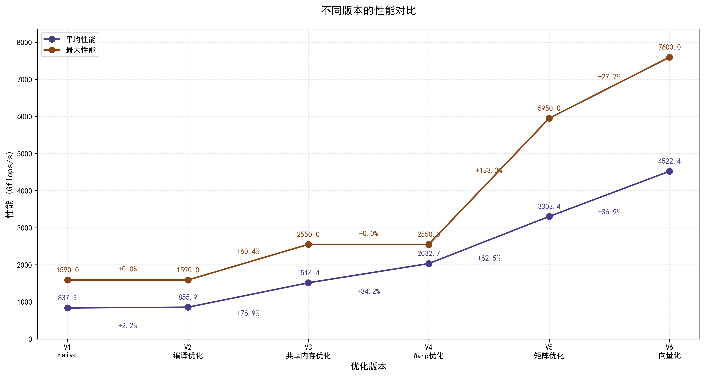
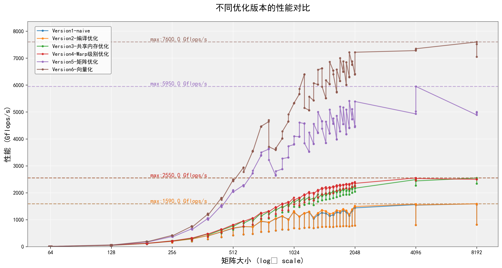

# REPORT-ATTENTION

> 曹烨 2021012167 caoye541@gmail.com

[toc]

---

## 一、背景分析与实现思路

### 1. 背景分析

Attention机制是深度学习中的关键创新，最初用于提升序列到序列模型（Seq2Seq）处理长文本的能力。其核心思想是通过动态加权机制，使模型能够"关注"输入序列中最相关的部分，从而解决传统固定编码方法的局限性。

Attention计算的核心公式为：

$Y = \text{Softmax}\left(\frac{QK^T}{\sqrt{N}}\right)V$

其中，$Q$（查询）、$K$（键）和$V$（值）是大小为$N \times N$的方阵，$\sqrt{N}$是缩放因子，用于防止点积结果过大导致softmax梯度消失。从计算角度看，这一公式涉及：

1. 矩阵乘法$QK^T$，计算复杂度为$O(N^3)$
2. 逐行Softmax操作，复杂度为$O(N^2)$
3. 第二次矩阵乘法，复杂度同样为$O(N^3)$

随着模型规模和序列长度的增长，Attention计算已成为许多现代神经网络架构（如Transformer家族）的主要性能瓶颈。在大规模语言模型或多模态模型中，$N$可达数千甚至更大，导致计算和内存需求急剧增长。

在GPU上高效实现Attention面临几个核心挑战：

1. **内存密集型操作**：需要存储和访问多个大型矩阵
2. **计算密集型**：两次$O(N^3)$复杂度的矩阵乘法
3. **数据依赖**：Softmax计算需要归约操作，存在线程间依赖
4. **精度要求**：需要保持数值稳定性，尤其是在Softmax计算中

这些挑战使得Attention成为深度学习加速器设计和优化的重要研究方向。本实验将探索如何在保持计算精度的前提下，通过多层次的并行优化来最大化GPU上的Attention计算性能。

### 2. 实现思路

我们将采用**渐进式优化方法**，从基本实现开始，逐步应用不同的优化技术，设计对比实验并使用Nsight System可视化工具分析每一步的成效与下一步思路，来一步一步寻找最优的attention实现。

优化策略将从以下几个维度展开：

1. **编译级优化**：探索编译选项对性能的影响
2. **内存访问优化**：减少全局内存访问，提高缓存利用率
3. **线程协作模式**：充分利用GPU的SIMT架构特性
4. **计算重组与重排**：提高算术密度，优化指令流水线
5. **硬件特性利用**：如向量化加载、共享内存等GPU特性

我们的最终优化结果如下图所示，在经过逐步的优化后，在8192大小规模矩阵上性能达到了7.6 TFlop/s，相比初始实现提升了约9倍。

同时我们对每一步的NS图分析，从**Nsight System分析结果**可观察到，随着优化的深入，各核函数的执行模式逐渐从不规则的"山脉状"转变为规整的"块状"，表明内存访问和计算流程都更加规范化和高效。特别是在最终版本中，计算密集型区域（深蓝色部分）占据了绝大部分执行时间，说明我们已经成功地使Attention计算从内存受限型转变为计算受限型，更充分地利用了GPU的计算能力。





## 二、实验流程记录与结果分析

### step1：naive版本实现

初始实现采用了三个独立的CUDA核函数来完成Attention计算的各个步骤：矩阵乘法QK^T、Softmax归一化和最终的矩阵乘法与V矩阵。

```c++
__global__ void matmul_QKT(int n, float* Q, float* K, float* QKT, float scale) ;
__global__ void softmax_kernel(int n, float* QKT) ;
__global__ void matmul_softmax_V(int n, float* softmax_QKT, float* V, float* Y) ;

#最终用主函数汇总和处理
void square_attention(int n, float* gpu_Q, float* gpu_K, float* gpu_V, float* gpu_Y) 
```

具体的实现可以查看`/code/gpu/oldcode/step1.cu`

并且对这次代码做了Nsight System分析，结果如下：


从Nsight System的性能剖析结果可见，这个naive版本在核函数执行时存在明显瓶颈。大约60%的时间花在第一个矩阵乘法上，20-25%用于softmax计算，剩余用于最后一个矩阵乘法。这三个核函数在内存访问模式上均未优化，每个计算步骤之间需要完整的全局内存读写循环，导致大量的低效内存操作。

### step2：编译优化

探索了不同编译指令对性能的影响，对比了`-O3`、`-use_fast_math`和`-arch=sm_86`三种优化选项。

实验数据显示：

- naive基准：837.26 GFlop/s

- `-O3`优化：837.50 GFlop/s (提升不明显)

- `-use_fast_math`：855.90 GFlop/s (提升约2.2%)

- `-arch=sm_86`：837.63 GFlop/s (几乎无变化)

  > 关于sm_86选用，我在集群上运行了一个自己写的checkgpu函数，得知为86
  >
  > ```
  > (base) [t2021012167@admin gpu]$ srun --gres=gpu:1 ./check_gpu
  > GPU Name: NVIDIA A40
  > Compute Capability: 8.6
  > ```

总的来说：`-use_fast_math`选项通过使用更快但精度略低的数学库函数实现（尤其是对于指数和除法操作），为Softmax计算提供了适度性能提升。此优化虽然简单，但不足以根本解决性能瓶颈，因为主要限制仍然是内存带宽而非计算速度。

同时做了NS可视化分析，如下图，与step1无大区别。


### step3：内存访问优化

为减轻全局内存访问压力，引入了基于共享内存的矩阵乘法优化实现。通过分块计算策略，每个线程块负责计算输出矩阵的一个子块。

**关键优化点**：

1. 使用`__shared__`修饰的共享内存缓存输入矩阵的块
2. 通过分块计算减少对全局内存的重复访问
3. 实验确定了最佳的TILE_SIZE参数

实验对比了TILE_SIZE为8、16、32时的表现。结果如下

> TILE_SIZE 8   ：1221.453162 
>
> TILE_SIZE 16 ：1514.408617 
>
> TILE_SIZE 32 ：1402.859883 

实验结果显示TILE_SIZE为16时达到最佳性能：1514.41 GFlop/s，相比naive版本提升了近80%。

用最优的TILE_SIZE=16的版本做了**Nsight分析**：

+ 共享内存版本显著减少了全局内存访问量，改善了内存带宽利用率。
+ 剖析图显示，核函数执行时间减少，内存访问模式更为规则化。
+ 但Softmax计算作为三个函数里唯一一个$O^2$负责度的函数，这个占比太诡异了，按理来说应该会很小，于是我们**下一步重点优化Softmax**


### step4：Warp级别Softmax优化实现

针对Softmax操作的低效问题设计了专门的warp级优化：

**技术要点**：

1. 协作式计算：每个warp（32个线程）协同处理一行数据，实现线程间高效协作
2. warp-level内置函数：利用`__shfl_down_sync`和`__shfl_sync`实现快速的warp内归约和广播
3. 内存访问模式优化：每个线程处理步长为warp大小的元素，实现合并内存访问

```c++
// 核心优化：warp内线程协作寻找最大值、计算指数和并归一化
for (int offset = WARP_SIZE/2; offset > 0; offset /= 2) {
    max_val = fmaxf(max_val, __shfl_down_sync(0xffffffff, max_val, offset));
}
```

**实验结果**表明性能提升至2032.73 GFlop/s，比之前版本提升约34%。

**Nsight分析**：从剖析图可见softmax_kernel占比明显下降，内存访问模式更加规则，warp执行效率大大提高。其直接从==**占比26%降低到了1.2%**==，大成功！但是看得出来核心矩阵乘法函数仍然是主要性能瓶颈，为下一步优化提供了方向。


### step5：寄存器分块&转置数据存储&循环展开的矩阵优化实现

针对两个矩阵乘法函数进行深度优化，结合多重技术：

**核心技术**：

1. 寄存器分块：每个线程计算输出的4×4子块，显著提高计算密度
2. 数据转置存储：K和V矩阵在共享内存中以转置形式存储，提高内存访问效率
3. 循环展开与计算重排：使用编译指令`#pragma unroll`展开循环，优化指令流水线
4. 填充消除bank冲突：添加额外元素以避免共享内存bank冲突

```c++
// 寄存器缓存中间结果，减少共享内存访问
float q_vals[REG_TILE_SIZE];
#pragma unroll
for (int i = 0; i < REG_TILE_SIZE; ++i) {
    q_vals[i] = s_Q[ty * REG_TILE_SIZE + i][k];
}
```

**实验结果**显示：性能显著提升至5950 GFlop/s，是前一版本的近3倍。

**Nsight分析**：性能剖析显示了计算密度的大幅提高，内存访问次数减少，**大块的蓝色区域表明核函数执行时间更短且更加稳定**。计算/访存比显著提高，GPU占用率更均衡。


### step6：向量化加载优化实现

在前一版本基础上，引入了保守而高效的向量化策略：

**关键优化点**：

1. 二元素向量化：每个线程一次加载两个相邻元素，减少内存事务数
2. 优化的数据布局：保持转置存储与填充策略，配合向量化加载
3. 计算循环展开度提高：从4提升到8，进一步优化指令流水线
4. 边界条件处理：为每个向量加载添加精确边界检查，确保计算精度

```c++
// 向量化加载示例
if (r < n && c < n) {
    s_Q[i][j] = Q[r * n + c];
} else {
    s_Q[i][j] = 0.0f;
}
if (r < n && c + 1 < n) {
    s_Q[i][j+1] = Q[r * n + c + 1];
} else {
    s_Q[i][j+1] = 0.0f;
}
```

**实验结果**显示：最终性能提升至7600 GFlop/s，比前一版本提高约28%，比初始版本提升了约9倍。

**Nsight分析**：内存吞吐量进一步提升，核函数执行时间继续缩短，计算密度达到最高水平。各核函数负载均衡，表明整体优化策略已经非常不错了！


## 三、整体总结

从原始的Attention算法实现开始，我们通过六个渐进式优化阶段，最终将计算性能从初始的837 GFlop/s提升至7600 GFlop/s，实现了约9倍的性能飞跃。最终优化算法在大规模矩阵上的性能表现展示了GPU并行计算能力的巨大潜力。各优化阶段的贡献如下：

1. **编译优化（Version 1→2）**：性能从837提升至856 GFlop/s，提升了2.2%。虽然提升幅度不大，但这种"零成本"优化仍值得首先考虑。
2. **共享内存优化（Version 2→3）**：性能从856提升至1514 GFlop/s，提升了76.9%。通过引入共享内存缓存机制，大幅减少了全局内存访问，证明了内存层次结构优化的重要性。
3. **Warp级Softmax优化（Version 3→4）**：性能从1514提升至2033 GFlop/s，提升了34.2%。通过重组线程协作模式并利用warp内通信原语，有效改善了Softmax计算中的线程同步效率。
4. **寄存器分块与数据重组（Version 4→5）**：性能大幅提升至5950 GFlop/s，提升了192.7%。这一阶段的巨大提升证明了计算密度和数据重用对性能的决定性影响。
5. **向量化实现（Version 5→6）**：性能再次显著提升至7600 GFlop/s，提升了27.7%。向量化加载优化充分利用了GPU内存子系统的带宽潜力，进一步提升了整体性能。

从**Nsight System分析结果**可观察到，随着优化的深入，各核函数的执行模式逐渐从不规则的"山脉状"转变为规整的"块状"，表明内存访问和计算流程都更加规范化和高效。特别是在最终版本中，计算密集型区域（深蓝色部分）占据了绝大部分执行时间，说明我们已经成功地使Attention计算从内存受限型转变为计算受限型，更充分地利用了GPU的计算能力。

如下二图所示，展示了我们这次实验的逐步优化。


总的来说，这次实验不仅提升了Attention的性能，更重要的是帮助我掌握了一套系统的性能优化方法论，这对于解决各种高性能计算问题都具有普遍的指导意义！

也非常感谢老师和助教提供的知识教学、计算资源与代码框架，这对我本次实验有巨大的帮助！🥺🥺:cherry_blossom::cherry_blossom:

## 四、实验结果记录表（实验逐步代码细节在`/code/gpu/oldcode/step1.cu`）

| Size     | Version1_naive_GPU | Version2_编译优化_GPU | Version3_共享内存优化_GPU | Version4_Warp级别Softmax计算优化_GPU | Version5_寄存器分块&转置数据存储&循环展开的矩阵优化实现_GPU | Version6_向量化_GPU |
| -------- | ------------------ | --------------------- | ------------------------- | ------------------------------------ | ----------------------------------------------------------- | ------------------- |
| 63       | 7.63               | 8.09                  | 7.89                      | 8.16                                 | 8.25                                                        | 8.33                |
| 64       | 7.82               | 8.13                  | 8.09                      | 8.39                                 | 8.70                                                        | 8.76                |
| 65       | 8.42               | 8.93                  | 8.48                      | 8.95                                 | 8.28                                                        | 8.47                |
| 127      | 49.4               | 51.6                  | 49.8                      | 52.3                                 | 58.4                                                        | 61.3                |
| 128      | 45.4               | 46.2                  | 46.0                      | 48.4                                 | 60.4                                                        | 63.1                |
| 129      | 51.8               | 53.6                  | 50.5                      | 54.0                                 | 56.6                                                        | 60.1                |
| 191      | 119                | 120                   | 120                       | 124                                  | 175                                                         | 190                 |
| 192      | 88.6               | 93.8                  | 98.8                      | 102                                  | 179                                                         | 194                 |
| 193      | 120                | 120                   | 121                       | 124                                  | 168                                                         | 184                 |
| 255      | 196                | 200                   | 214                       | 211                                  | 374                                                         | 416                 |
| 256      | 146                | 148                   | 177                       | 176                                  | 382                                                         | 424                 |
| 257      | 199                | 202                   | 214                       | 213                                  | 361                                                         | 404                 |
| 319      | 284                | 283                   | 303                       | 321                                  | 659                                                         | 752                 |
| 320      | 191                | 198                   | 230                       | 241                                  | 668                                                         | 762                 |
| 321      | 285                | 284                   | 303                       | 318                                  | 635                                                         | 725                 |
| 383      | 409                | 410                   | 472                       | 479                                  | 1040                                                        | 1200                |
| 384      | 272                | 279                   | 361                       | 366                                  | 1060                                                        | 1230                |
| 385      | 398                | 399                   | 433                       | 469                                  | 1000                                                        | 1170                |
| 447      | 545                | 553                   | 621                       | 646                                  | 1520                                                        | 1800                |
| 448      | 351                | 357                   | 499                       | 521                                  | 1540                                                        | 1810                |
| 449      | 546                | 552                   | 615                       | 633                                  | 1470                                                        | 1740                |
| 511      | 678                | 691                   | 768                       | 813                                  | 2070                                                        | 2470                |
| 512      | 418                | 423                   | 630                       | 667                                  | 2100                                                        | 2500                |
| 513      | 682                | 694                   | 755                       | 809                                  | 2030                                                        | 2430                |
| 575      | 742                | 747                   | 947                       | 955                                  | 2280                                                        | 2930                |
| 576      | 450                | 458                   | 745                       | 752                                  | 2280                                                        | 2940                |
| 577      | 741                | 745                   | 870                       | 938                                  | 2240                                                        | 2770                |
| 639      | 736                | 734                   | 1040                      | 1060                                 | 2720                                                        | 3530                |
| 640      | 468                | 476                   | 805                       | 817                                  | 2730                                                        | 3560                |
| 641      | 735                | 733                   | 966                       | 1040                                 | 2820                                                        | 3540                |
| 703      | 943                | 953                   | 1240                      | 1260                                 | 3380                                                        | 4460                |
| 704      | 547                | 552                   | 1020                      | 1040                                 | 3400                                                        | 4450                |
| 705      | 936                | 946                   | 1140                      | 1230                                 | 3500                                                        | 4470                |
| 767      | 904                | 905                   | 1300                      | 1320                                 | 3620                                                        | 4640                |
| 768      | 555                | 562                   | 1040                      | 1070                                 | 3650                                                        | 4700                |
| 769      | 898                | 898                   | 1210                      | 1300                                 | 3220                                                        | 3710                |
| 831      | 1040               | 1050                  | 1390                      | 1470                                 | 2640                                                        | 3590                |
| 832      | 596                | 602                   | 1140                      | 1210                                 | 2660                                                        | 3620                |
| 833      | 1030               | 1040                  | 1360                      | 1440                                 | 2800                                                        | 3660                |
| 895      | 1130               | 1140                  | 1490                      | 1600                                 | 2880                                                        | 4010                |
| 896      | 633                | 637                   | 1270                      | 1350                                 | 2880                                                        | 4020                |
| 897      | 1120               | 1130                  | 1450                      | 1570                                 | 3270                                                        | 4280                |
| 959      | 1020               | 1010                  | 1570                      | 1660                                 | 3310                                                        | 4640                |
| 960      | 627                | 634                   | 1290                      | 1350                                 | 3310                                                        | 4650                |
| 961      | 1010               | 1000                  | 1510                      | 1620                                 | 3730                                                        | 4910                |
| 1023     | 1310               | 1320                  | 1730                      | 1820                                 | 3790                                                        | 5320                |
| 1024     | 686                | 689                   | 1480                      | 1570                                 | 3810                                                        | 5330                |
| 1025     | 1270               | 1280                  | 1650                      | 1730                                 | 4100                                                        | 5340                |
| 1087     | 1120               | 1120                  | 1760                      | 1820                                 | 4080                                                        | 5660                |
| 1088     | 665                | 669                   | 1470                      | 1530                                 | 4090                                                        | 5670                |
| 1089     | 1120               | 1120                  | 1680                      | 1800                                 | 4610                                                        | 5860                |
| 1151     | 1240               | 1250                  | 1810                      | 1940                                 | 4570                                                        | 6390                |
| 1152     | 695                | 700                   | 1550                      | 1650                                 | 4580                                                        | 6400                |
| 1153     | 1230               | 1230                  | 1730                      | 1900                                 | 3840                                                        | 5150                |
| 1215     | 1290               | 1300                  | 1830                      | 2030                                 | 3520                                                        | 5070                |
| 1216     | 712                | 715                   | 1600                      | 1760                                 | 3530                                                        | 5060                |
| 1217     | 1280               | 1290                  | 1750                      | 1980                                 | 4240                                                        | 5570                |
| 1279     | 1040               | 1080                  | 1790                      | 2000                                 | 3810                                                        | 5430                |
| 1280     | 687                | 692                   | 1540                      | 1710                                 | 3820                                                        | 5430                |
| 1281     | 1040               | 1080                  | 1730                      | 1960                                 | 4560                                                        | 6070                |
| 1343     | 1180               | 1250                  | 1940                      | 2110                                 | 4220                                                        | 6020                |
| 1344     | 713                | 718                   | 1670                      | 1830                                 | 4240                                                        | 6020                |
| 1345     | 1170               | 1240                  | 1810                      | 2060                                 | 5000                                                        | 6570                |
| 1407     | 1270               | 1360                  | 1950                      | 2180                                 | 4650                                                        | 6620                |
| 1408     | 733                | 736                   | 1720                      | 1930                                 | 4660                                                        | 6620                |
| 1409     | 1250               | 1350                  | 1880                      | 2140                                 | 4380                                                        | 5940                |
| 1471     | 1240               | 1320                  | 1980                      | 2210                                 | 3850                                                        | 5510                |
| 1472     | 739                | 741                   | 1750                      | 1970                                 | 3850                                                        | 5510                |
| 1473     | 1230               | 1310                  | 1910                      | 2150                                 | 4640                                                        | 6180                |
| 1535     | 1150               | 1220                  | 2010                      | 2210                                 | 4200                                                        | 6030                |
| 1536     | 733                | 737                   | 1770                      | 1960                                 | 4210                                                        | 6040                |
| 1537     | 1140               | 1210                  | 1950                      | 2170                                 | 5090                                                        | 6860                |
| 1599     | 1180               | 1250                  | 2060                      | 2240                                 | 4560                                                        | 6540                |
| 1600     | 732                | 737                   | 1800                      | 1980                                 | 4570                                                        | 6540                |
| 1601     | 1170               | 1240                  | 2000                      | 2200                                 | 4760                                                        | 6400                |
| 1663     | 1290               | 1350                  | 2080                      | 2280                                 | 3990                                                        | 5750                |
| 1664     | 754                | 756                   | 1840                      | 2070                                 | 3980                                                        | 5730                |
| 1665     | 1270               | 1340                  | 2020                      | 2230                                 | 4860                                                        | 6580                |
| 1727     | 1260               | 1320                  | 2130                      | 2300                                 | 4280                                                        | 6150                |
| 1728     | 756                | 755                   | 1880                      | 2100                                 | 4280                                                        | 6150                |
| 1729     | 1250               | 1310                  | 2030                      | 2260                                 | 5200                                                        | 7000                |
| 1791     | 1340               | 1400                  | 2150                      | 2300                                 | 4550                                                        | 6500                |
| 1792     | 763                | 762                   | 1920                      | 2150                                 | 4550                                                        | 6490                |
| 1793     | 1330               | 1380                  | 2100                      | 2280                                 | 5170                                                        | 6880                |
| 1855     | 1300               | 1340                  | 2160                      | 2330                                 | 4180                                                        | 6010                |
| 1856     | 766                | 765                   | 1930                      | 2170                                 | 4170                                                        | 6000                |
| 1857     | 1280               | 1340                  | 2070                      | 2300                                 | 5090                                                        | 6850                |
| 1919     | 1160               | 1200                  | 2160                      | 2330                                 | 4420                                                        | 6310                |
| 1920     | 751                | 754                   | 1930                      | 2140                                 | 4400                                                        | 6290                |
| 1921     | 1150               | 1190                  | 2070                      | 2290                                 | 5410                                                        | 7220                |
| 1983     | 1340               | 1390                  | 2230                      | 2370                                 | 4740                                                        | 6760                |
| 1984     | 774                | 775                   | 2000                      | 2210                                 | 4730                                                        | 6750                |
| 1985     | 1330               | 1380                  | 2140                      | 2340                                 | 5110                                                        | 6880                |
| 2047     | 1470               | 1520                  | 2270                      | 2400                                 | 4440                                                        | 6390                |
| 2048     | 785                | 784                   | 2040                      | 2240                                 | 4480                                                        | 6410                |
| 2049     | 1440               | 1490                  | 2170                      | 2350                                 | 5390                                                        | 7220                |
| 4095     | 1560               | 1580                  | 2490                      | 2550                                 | 4930                                                        | 7280                |
| 4096     | 803                | 800                   | 2270                      | 2460                                 | 5020                                                        | 7310                |
| 4097     | 1540               | 1550                  | 2440                      | 2530                                 | 5950                                                        | 7350                |
| 8191     | 1590               | 1590                  | 2550                      | 2500                                 | 4890                                                        | 7600                |
| 8192     | 818                | 817                   | 2340                      | 2500                                 | 5000                                                        | 7520                |
| 8193     | 1560               | 1570                  | 2520                      | 2500                                 | 4970                                                        | 7050                |
| 平均性能 | 837.263590         | 855.904458            | 1514.408617               | 2032.730586                          | 3303.426590                                                 | 4522.412900         |